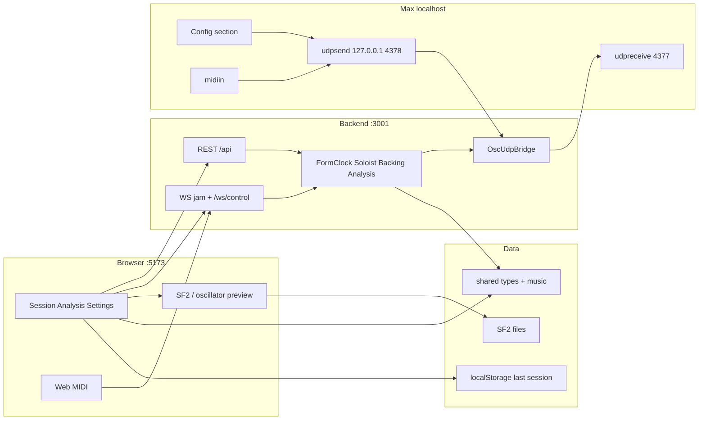

# Jazz Gen

A real-time jazz practice partner. Configure a tune, a bot soloist, and a backing band; trade choruses over a chord chart with live MIDI; then review the solo with scale-degree and chord-tone analysis.

Guests jam with no account. Session APIs stay anonymous. An optional **local Cycling '74 Max** surface talks to the backend over **OSC on UDP** (not HTTP, not WebSocket) for hardware MIDI, custom synths, and aligned setup controls.

This README is the **canonical standing snapshot** (August 2026). Prefer it and the live code when older `cursor-docs` files disagree.

---

## Contents

1. [Overview](#overview)
2. [How a jam works](#how-a-jam-works)
3. [Architecture](#architecture)
4. [Max link (OSC / UDP)](#max-link-osc--udp)
5. [Current standing](#current-standing)
6. [Usability](#usability)
7. [Latency](#latency)
8. [Still needed](#still-needed)
9. [Getting started](#getting-started)
10. [Further reading](#further-reading)

---

## Overview

Jazz Gen is a monorepo web app plus a Node session server. The product goal is a sympathetic practice partner: it reads a standard chord chart, keeps time, trades measured choruses, generates a modular backing track, and (later) should respond musically to what you play.

**Today you can:**

- Pick a preset chart (Blues in F, jazz blues in C, rhythm changes in Bb), tempo, soloist instrument/style, who starts, trade length, and band feel + instruments
- Start a session and hear a procedural soloist plus a looping SF2 band in the browser (Chrome / Edge for Web MIDI)
- Play a MIDI keyboard into the player buffer during your chorus; the soloist can answer with a motif trade when it has enough notes
- Stop and open Analysis (notation + piano roll, chord / color / tension labels, phrase summary)
- Optionally open Max, connect over localhost OSC/UDP, keep Soloist/Trading/Band config aligned, route notes into Max, and send hardware MIDI back into the jam

**North star (not built):** several real people jamming successfully with the program, with ML-quality soloing and persisted practice history.

---

## How a jam works

```
Idle setup  →  Start  →  form clock + turns  →  Stop  →  Analysis
```

1. On `/`, configure tune / soloist / band (and optionally confirm Max is connected).
2. **Start session** → `POST /api/sessions` → browser opens `/ws/sessions/:id` → `POST .../start`.
3. Backend starts [`FormClockService`](backend/src/services/FormClockService.ts) (authoritative beats and chorus flips). It sends `backing_track_ready` and, if soloist-first, `soloist_midi_out`.
4. Browser schedules SF2 playback. The same events also fan out to Max as OSC (if linked).
5. During `player_solo`, Web MIDI (browser) and/or Max `midiin` land in the same player note buffer.
6. At chorus boundaries the clock flips player ↔ soloist. Soloist either trades a motif or generates a style-driven line ([`shared/music`](shared/music)).
7. **Stop** → analysis of soloist notes (or player notes if no soloist line) → saved in `localStorage` → `/analysis`.

No login is required. This loop is anonymous.

---

## Architecture

Three Node packages (no root workspace), plus a Max starter patch and design docs:

```
music-gen-repo/
├── frontend/          # Vite + React 19 (:5173)
├── backend/           # Express + ws + OSC/UDP sidecar (:3001)
├── shared/            # @music-gen/shared — types, music engines, SF2 map
├── max/               # stock Max link patch (OSC/UDP)
├── cursor-docs/       # briefs, contracts, older standing notes
└── README.md          # this file — current standing
```

| Layer | Stack |
|-------|--------|
| Frontend | Vite, React 19, TypeScript, React Router, `js-synthesizer` |
| Backend | Node 20+, Express, `ws`, `osc` (UDP), TypeScript (`tsx` in dev) |
| Shared | Types, `soundfontManifest`, pure `music/` generators + tests |
| Persistence | None hosted — one `localStorage` last session; local SQL later |
| Browser audio | SF2 from `/soundfonts` via FluidSynth AudioWorklet; sax = oscillator fallback |
| Max (optional) | Stock Max `udpreceive` / `udpsend` — no Node for Max, no third-party packages |

### Dual transport



| Hop | Protocol | Role |
|-----|----------|------|
| Browser → backend | HTTP REST | Create/start/stop session, analysis GET, Max config GET/PUT, soundfont manifest |
| Browser ↔ backend | WebSocket `/ws/sessions/:id` | Live jam: `session_state`, soloist/backing MIDI, analysis ready; `midi_input` in |
| Browser ↔ backend | WebSocket `/ws/control` | Push Max link config into the UI (Max cannot talk HTTP/WS) |
| Backend ↔ Max | **OSC over UDP** on `127.0.0.1` | Config mirror, session clock, note batches, hardware noteon/off |

**Jazz Gen owns the jam brain.** Max is a peer renderer / controller, not the form-clock master. Currency on every musical wire is **MIDI events + control**, not PCM/WAV.

### Backend services

| Service | Job |
|---------|-----|
| `SessionService` | In-memory sessions + player/soloist note buffers |
| `FormClockService` | Beat ticks, chorus flips, soloist generate, band energy refresh |
| `SoloistService` | Motif trade if enough player notes; else `buildSoloNotes` |
| `BackingTrackService` | `buildBackingParts` (empty `audioUrl`; browser/Max render MIDI) |
| `AnalysisService` | `analyzeNotes` + adapter |
| `MaxLinkService` | Mirrored setup + render mode + connection status + `activeSessionId` |
| `OscUdpBridge` | Localhost UDP send `:4377` / receive `:4378` |

### Shared music library (`shared/music/`)

Pure TypeScript: chart + notes + config → notes / analysis. Used by backend services; frontend uses chart presets.

Pitch, chart parse, scales, analyze, phrase, solo, trade, session memory, backing, band arranger, chart presets. Tests: `cd shared && npm test`.

---

## Max link (OSC / UDP)

**Yes — OSC messages transported over UDP.** Not TCP. Not WebSocket. Not HTTP.

Stock Max only: `[udpreceive]` and `[udpsend]`. Fresh Max does not ship OSC-over-TCP without extra packages; that path was dropped so you can install Max, open one patch, and match two ports.

| Direction | Default | Max object |
|-----------|---------|------------|
| App → Max | `127.0.0.1:4377` | `[udpreceive 4377]` |
| Max → App | `127.0.0.1:4378` | `[udpsend 127.0.0.1 4378]` |

Override with `JAZZGEN_OSC_SEND_PORT` / `JAZZGEN_OSC_RECEIVE_PORT`. Bind is localhost only.

Backend heartbeats `/jazzgen/hello` every 2s. **Connected** in Settings = a packet from Max within ~5s.

### What syncs

Mirrored with the web **Session setup** (not the chord-strip / “arrow chart”):

- Tempo, solo instrument, solo style, who starts, trade length, band feel, band instrument chips, preset id / title
- Render mode (`sf2` / `max_soloist` / `max_band` / `both`) and browser SF2 preview on/off

Idle: change a umenu in Max or a select in the browser → `MaxLinkService` → the other side updates. Live jam: same mirror for Max UI; the **running session** still uses the config captured at Start (mid-session tempo edits do not retune the live clock yet).

### What moves during a jam

- `/jazzgen/session/state` — phase, chorus, BPM, bar/beat, active player
- `/jazzgen/soloist/begin|note|end` — chorus batch as discrete notes
- `/jazzgen/backing/begin|note|end` — band parts + energy
- `/jazzgen/midi/noteon` + `/noteoff` — Max hardware in; backend stamps `startBeat` / duration from the form clock (gated to `player_solo`)

Starter patch [`max/jazzgen-link.maxpat`](max/jazzgen-link.maxpat) is a **link + config + simple noteout**, not a full house-band instrument rack. Deep OSC map: [cursor-docs/max-local-osc-architecture.md](cursor-docs/max-local-osc-architecture.md). Connect steps: [max/README.md](max/README.md).

---

## Current standing

Snapshot of **what the repo actually does** (August 2026).

### Working end-to-end

| Area | Notes |
|------|--------|
| Session create / start / stop | In-memory `SessionService` |
| Jam WebSocket | `midi_input` in; state / backing / soloist / analysis out |
| Server form clock + turn flips | `FormClockService` — authoritative; UI soft-syncs |
| Procedural soloist + motif trade | `shared/music` via `SoloistService` (not canned stubs) |
| Theory analysis | `analyzeNotes` → Analysis UI |
| Backing MIDI by feel | Heuristic parts + real SF2 loop in the browser |
| Band energy refresh | After some player → soloist flips |
| Web MIDI capture | Chrome / Edge |
| SF2 playback | Trumpet, piano, guitar, bass / comp / drums kits |
| Last-session analysis | One `localStorage` slot → `/analysis` |
| Max OSC/UDP sidecar | Config mirror, clock/notes out, midiin in, Settings + session status strip |
| `/ws/control` + `/api/max/config` | Browser sees Max link state |

### Thin / placeholder

| Area | Notes |
|------|--------|
| Alto / tenor sax | Triangle oscillator (`engine: 'oscillator'`) |
| Max starter patch | Config + hello + crude `makenote`/`noteout`; not beat-scheduled, not a real band |
| Settings “Soloist defaults” / “Local presets” | Still “Soon” |
| Session / analysis history | Last stop only |
| `MlInferenceClient` | Empty stub |
| Leftover `midiResponses` stubs | Not on the live soloist path |
| WS `config_update` / turn-request | Typed; not handled on the jam socket |
| `form_clock_tick` message type | Exists; clock arrives via `session_state` |

### Not started

- ML / FastAPI soloist or analysis
- Local SQLite for named presets / analysis history
- Dedicated sax SF2s
- Chart text loaders, mic transcription
- Max as clock master or ML host
- Multi-player / multi-browser cooperative jam

---

## Usability

**Web-only jam (default):** open the app, pick a preset, Start, listen / play MIDI, Stop, open Analysis. No Max required. No login required.

**With Max:** install Max → open `max/jazzgen-link.maxpat` → match ports in **Settings → Max link** → hello. Setup controls stay aligned. You can preview in the browser, render in Max, or both (`sf2Preview` + render mode). Hardware on Max `midiin` feeds the same trade engine as browser Web MIDI during player choruses.

**Limits you will feel:**

- One analysis slot; refresh-safe only via `localStorage`
- Sax sounds like a placeholder oscillator
- Max patch will not sound like a studio band until you build instruments / scheduling in Max
- Changing setup during a live jam does not rebuild the running session
- MIDI input is ignored unless the phase is `player_solo`
- Sessions die if the backend process restarts

---

## Latency

| Path | Expectation |
|------|-------------|
| Browser REST | Fine for start/stop / config PUT |
| Browser jam WS | Localhost control latency is small vs musical timing |
| OSC/UDP localhost | Fine for hello, config, and burst note lists |
| Musical tightness | Comes from a **shared form clock** and **scheduling chorus batches ahead**, not from streaming note-on packets |

Generation is chorus-sized (or trade-phrase-sized), not token-by-token ML. The browser SF2 engine schedules from `startBeat` / `durationBeats` + BPM. Max **should** do the same; the shipped starter patch plays notes through `makenote` without beat-accurate delays — good enough to prove the pipe, not tight enough for a record.

UDP can drop packets. Heartbeats and config retries are cheap. A dropped note in a soloist burst would skip that hit in Max; there is no reliability layer in v1. For local use this is usually acceptable.

Do not stream audio over these sockets. Sound is rendered where you choose (browser SF2, Max, or both).

---

## Still needed

Product / music:

- Replace procedural soloist (and optionally analysis) with ML behind the existing FastAPI-shaped types
- Dedicated sax soundfonts; drop oscillator fallback
- Richer Max instruments and **beat-accurate scheduling** of `/jazzgen/soloist/note` and backing notes
- Chart text import; optional audio transcription for non-MIDI players
- Multi-chorus analysis review UI

Platform:

- Persist sessions + analysis locally (SQLite on the lab machine) when history / named presets matter; see [cursor-docs/local-persistence.md](cursor-docs/local-persistence.md)
- Apply live config changes to a running session (tempo / feel) instead of mirror-only
- Optional UDP→TCP or sequenced note streams if Max reliability becomes an issue
- Keep `cursor-docs` briefs from drifting (this README wins on standing)

---

## Getting started

**Prerequisites:** Node.js 20+, Chrome or Edge for Web MIDI. Max is optional.

### 1. Backend (port 3001)

```bash
cd backend
npm install
npm run dev
```

Serves REST (`/api`), WebSocket (`/ws/sessions/:id`, `/ws/control`), static soundfonts (`/soundfonts`), and Max OSC/UDP (`4377` → Max, `4378` ← Max).

### 2. Frontend (port 5173)

```bash
cd frontend
npm install
npm run dev
```

Open [http://localhost:5173](http://localhost:5173). Vite proxies `/soundfonts` to the backend.

### 3. Max (optional)

See [max/README.md](max/README.md). Open `max/jazzgen-link.maxpat`, match **Settings → Max link**, click hello (or wait for loadbang).

Optional frontend URL overrides:

```env
VITE_API_BASE_URL=http://localhost:3001
VITE_WS_BASE_URL=ws://localhost:3001
```

Backend OSC ports:

```env
JAZZGEN_OSC_SEND_PORT=4377
JAZZGEN_OSC_RECEIVE_PORT=4378
```

### Key flows

| Flow | Where |
|------|--------|
| Jam | `/` — setup, Start, play/listen, Stop |
| Analysis | Nav → Analysis (last stopped session) |
| MIDI device | Settings → MIDI input |
| Max link | Settings → Max link + `max/jazzgen-link.maxpat` |

Music unit tests: `cd shared && npm test`.

---

## Further reading

| Doc | Purpose |
|-----|---------|
| [cursor-docs/01-app-overview.md](cursor-docs/01-app-overview.md) | Product vision and glossary |
| [cursor-docs/02-data-contracts.md](cursor-docs/02-data-contracts.md) | Shared types, REST, WebSocket shapes |
| [cursor-docs/03-frontend-architecture.md](cursor-docs/03-frontend-architecture.md) | UI structure |
| [cursor-docs/04-backend-architecture.md](cursor-docs/04-backend-architecture.md) | Services (pre-Max in places) |
| [cursor-docs/max-local-osc-architecture.md](cursor-docs/max-local-osc-architecture.md) | OSC/UDP Max sidecar design |
| [cursor-docs/local-persistence.md](cursor-docs/local-persistence.md) | Future local SQLite (users / configs / analysis history) |
| [cursor-docs/current-standing.md](cursor-docs/current-standing.md) | Older July 2026 snapshot (pre-Max); superseded by this README |
| [cursor-docs/Jazz Instrumentalist.md](cursor-docs/Jazz%20Instrumentalist.md) | Original client brief |
| [max/README.md](max/README.md) | Five-step Max connect |

When docs conflict with running code, trust the code and this README.
