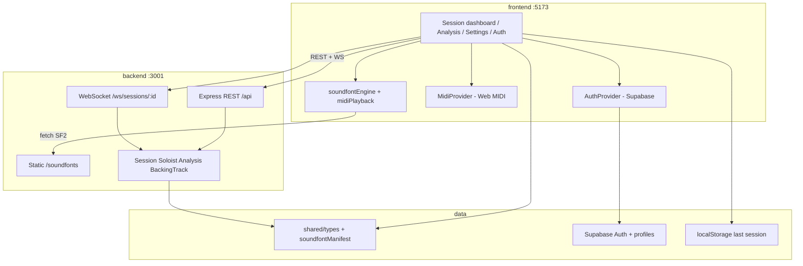

# Jazz Gen

A real-time jazz practice partner: configure a soloist and backing band, trade choruses over a chord chart (with live MIDI input), and review solos with scale-degree and chord-tone analysis.

Guests can jam without an account. Optional Supabase login stores a user profile only — session APIs stay anonymous for now.

## Current status

This is a working skeleton with real session plumbing, Web MIDI, SF2 playback, and analysis UI. Several musical engines are still stubs (canned soloist MIDI, heuristic analysis labels). See [Real vs stub](#real-vs-stub) below.

## Features

- **Session dashboard** — left: tune / tempo / soloist / backing config; right: live stage (form clock, turns, playback)
- **Soloist** — instrument + style (bebop / lyrical / outside) + who starts first
- **Backing** — style + bass / drums / piano / guitar / vibes, rendered with soundfonts
- **Web MIDI input** — capture player solos (Chrome / Edge); device picker in Settings
- **Analysis** — notation table + labeled piano roll (degrees, chord / color / tension tones)
- **Auth** — email/password via Supabase; optional; does not gate jamming

## Tech stack

| Layer | Stack |
|-------|--------|
| Frontend | Vite, React 19, TypeScript, React Router, `@supabase/supabase-js`, `js-synthesizer` |
| Backend | Node.js, Express, `ws`, TypeScript (`tsx` in dev) |
| Shared | `@music-gen/shared` — API contracts + soundfont instrument map |
| Auth / DB | Supabase Auth + `profiles` (RLS); frontend-only |
| Audio | SF2 files from backend `/soundfonts`; FluidSynth via AudioWorklet in the browser |

## Architecture

Monorepo: React UI talks to a Node session server over REST + WebSocket. Shared TypeScript types keep both sides aligned. Soundfonts are served statically from the backend and played in the browser. Auth hits Supabase directly from the client. The last stopped session’s analysis is stored in `localStorage`.



**Session flow:** configure → `POST /api/sessions` → WebSocket connect → `POST .../start` → `backing_track_ready` (+ `soloist_midi_out` if soloist starts) → player notes via `midi_input` → `POST .../stop` → analysis saved locally → open `/analysis`.

### Real vs stub

| Area | Status |
|------|--------|
| Session create / start / stop + WebSocket | Real (in-memory) |
| Soloist melodies | Stub — canned MIDI by style |
| Analysis labeling | Stub — heuristic degree / function labels |
| Backing MIDI parts | Heuristic stub; SF2 playback is real |
| Soundfonts (trumpet, piano, guitar, backing) | Real SF2 |
| Alto / tenor sax | Triangle oscillator placeholder |
| Backend form clock / ML client | Not implemented (form clock ticks on the client) |
| Supabase auth + profiles | Real on the frontend |
| API auth / persistent sessions | Not wired |

## Repository layout

```
music_gen_app/
├── frontend/          # UI, AuthProvider, MidiProvider, SF2 playback, Vite proxy
├── backend/           # Express + WS, session services, src/soundfonts/
├── shared/            # Canonical types + soundfontManifest
├── supabase/          # SQL migrations (profiles + RLS)
└── cursor-docs/       # Deeper design docs and contracts
```

## Getting started

**Prerequisites:** Node.js 20+, Chrome or Edge for Web MIDI.

### 1. Backend (port 3001)

```bash
cd backend
npm install
npm run dev
```

Serves REST (`/api`), WebSocket (`/ws/sessions/:id`), and static soundfonts (`/soundfonts`).

### 2. Frontend (port 5173)

```bash
cd frontend
npm install
npm run dev
```

Open [http://localhost:5173](http://localhost:5173). Vite proxies `/soundfonts` to the backend.

### 3. Supabase (optional — for login / signup)

1. Create a Supabase project and enable Email auth.
2. Run [`supabase/migrations/001_profiles.sql`](supabase/migrations/001_profiles.sql) in the SQL Editor.
3. In `frontend/`, create a `.env` (or `.env.local`) with:

```env
VITE_SUPABASE_URL=https://YOUR_PROJECT_REF.supabase.co
VITE_SUPABASE_ANON_KEY=your_anon_key
```

Use the **project root URL** only — do **not** append `/rest/v1/`. Restart Vite after changing env.

Optional overrides:

```env
VITE_API_BASE_URL=http://localhost:3001
VITE_WS_BASE_URL=ws://localhost:3001
```

## Key flows

| Flow | How |
|------|-----|
| **Jam** | `/` — configure on the left, **Start session**, play/listen on the right, **Stop** |
| **Analysis** | Nav → Analysis (loads last stopped session from `localStorage`) |
| **MIDI** | Settings → MIDI input — request access, pick device, test notes |
| **Account** | Sign up / Log in — profile row created via Supabase trigger + RLS |

## Further reading

| Doc | Purpose |
|-----|---------|
| [cursor-docs/01-app-overview.md](cursor-docs/01-app-overview.md) | Product vision and glossary |
| [cursor-docs/02-data-contracts.md](cursor-docs/02-data-contracts.md) | Shared types, REST, WebSocket shapes |
| [cursor-docs/03-frontend-architecture.md](cursor-docs/03-frontend-architecture.md) | UI structure and client layers |
| [cursor-docs/04-backend-architecture.md](cursor-docs/04-backend-architecture.md) | Services and session orchestration |
| [cursor-docs/Jazz Instrumentalist.md](cursor-docs/Jazz%20Instrumentalist.md) | Original client brief |

Prefer this README and the live code when older docs conflict with what is implemented.

## Roadmap

- Replace stub soloist / analysis with ML (FastAPI boundary already sketched in contracts)
- Authoritative backend form clock
- Persist sessions and analysis history (user-scoped)
- Dedicated sax soundfonts; drop oscillator fallback
- JWT-protect session APIs when accounts own jam data
