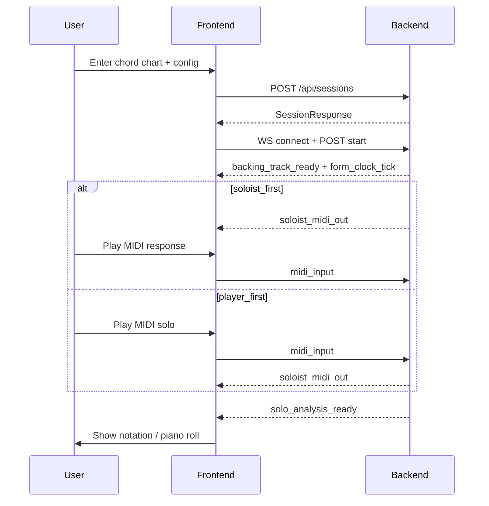

# App Overview — Jazz Instrumentalist

> **Read first.** Technical details live in the linked docs below. The canonical API shapes are in [02-data-contracts.md](./02-data-contracts.md).

## Vision

A real-time adaptive jazz soloist that responds to live MIDI input and improvises with awareness of western music theory. The app acts as a live musical partner and practice tool — sympathetic to what the player is playing, able to read a standard chord chart, trade measured choruses, and generate a modular backing track for both player and soloist.

**North star:** multiple real people jamming cooperatively with the program in a successful session.

## Documentation Index

| Doc | Purpose |
|-----|---------|
| [02-data-contracts.md](./02-data-contracts.md) | **Single source of truth** — shared TypeScript types, REST endpoints, WebSocket messages |
| [03-frontend-architecture.md](./03-frontend-architecture.md) | React/TS UI structure, routes, client layers |
| [04-backend-architecture.md](./04-backend-architecture.md) | Node/TS service layout, session orchestration, stub engines |

Original client brief (verbatim): [Jazz Instrumentalist.md](./Jazz%20Instrumentalist.md)

## Tech Stack

| Layer | Choice | Notes |
|-------|--------|-------|
| Frontend | Vite + React + TypeScript | Existing scaffold in `frontend/` |
| Backend | Node.js + TypeScript | New; skeleton phase returns stub data |
| Future ML | FastAPI (external) | Model inference out of scope for skeleton; boundary types defined in contracts |

Both app layers share the **same TypeScript contract definitions** to prevent drift. When coding begins, types move to a `shared/` package imported by both sides.

## MVP Features (Skeleton Scope)

### 1. Improvising Soloist

- Generates solos from MIDI input (rhythmic + harmonic patterns) and jazz harmony rules
- Locked to backing-track time; plays one full chorus and resolves cleanly at form end
- Configurable **instrument** (trumpet, saxophone, piano, guitar, etc.)
- Configurable **style**: bebop, lyrical, outside
- Configurable **turn order**: player first or soloist first
- Avoids overuse of harsh dissonance and odd rhythms
- Emphasizes call-and-response interplay between player and bot

### 2. Backing Track Generator

- Built from a supplied chord chart
- **Styles**: bebop, swing, latin, bossa nova, straight
- **Rhythm**: upright bass, drums (with variation/fills)
- **Comping**: piano, guitar, vibraphone
- Runs continuously while player and soloist trade choruses
- **Form clock**: bar, beat, elapsed time — shows top-of-form and keeps soloist start/stop aligned

### 3. Solo Analysis

- Notates and describes each solo chorus
- Scale degrees relative to each chord in the form
- Classifies notes as chord tones, consonant color tones, or dissonant tension tones
- Renders in standard notation or piano-roll view

## Primary User Flow (One Jam Session)

## Roadmap (Out of Skeleton Scope)

- Interactive full-band backing (diffusion-AI direction per client notes)
- Audio transcription of non-MIDI instruments (e.g. Basic Pitch)
- FastAPI model integration replacing stub solo/backing/analysis engines
- Persistent solo history and practice review

## Glossary

| Term | Definition |
|------|------------|
| **Key center** | The pitch or chord that feels like the tonal center at a given moment |
| **Chord chart** | Shorthand map of a song's chords over time, with bar lines and section labels |
| **Chord progression** | A sequence of chords |
| **Chord symbol** | Compact chord label, e.g. `Dm7`, `G7alt`, `Cmaj7` |
| **Resolution** | Musical tension moving to a more stable sound |
| **Chord tones** | Notes that belong directly to the current chord |
| **Form** | Full structure of a tune (blues / jazz blues is especially important) |
| **Beat** | The basic pulse |
| **Motif** | Short recognizable idea — taken from the player and developed in the soloist's response |
| **Chorus** | One full pass through the chord chart form |

## Drift Prevention

1. [02-data-contracts.md](./02-data-contracts.md) is canonical — if frontend and backend disagree, contracts win
2. Architecture docs reference contract sections; they do not redefine types
3. No application code until these docs are reviewed and agreed on
