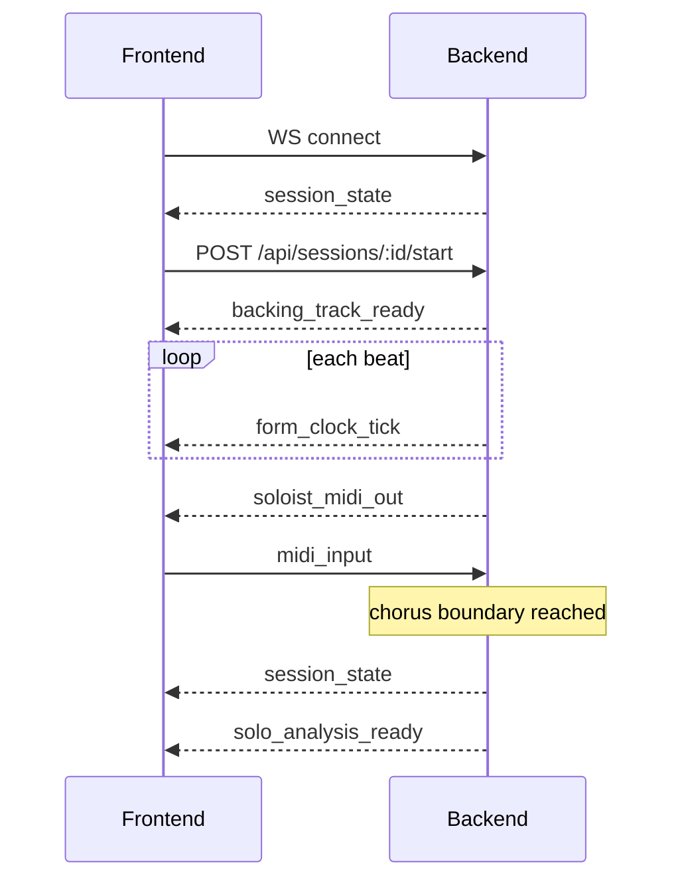

# Data Contracts

> **Canonical source of truth.** Overview: [01-app-overview.md](./01-app-overview.md). [03-frontend-architecture.md](./03-frontend-architecture.md) and [04-backend-architecture.md](./04-backend-architecture.md) implement these shapes exactly — they do not redefine types. When coding begins, these definitions become a `shared/types` package imported by both `frontend/` and `backend/`.

---

## § Domain Enums

```typescript
/** Soloist output instrument */
export type SoloInstrument =
  | 'trumpet'
  | 'alto_sax'
  | 'tenor_sax'
  | 'piano'
  | 'guitar';

/** How the soloist improvises */
export type SoloStyle = 'bebop' | 'lyrical' | 'outside';

/** Who plays the opening chorus */
export type TurnOrder = 'player_first' | 'soloist_first';

/** Backing track feel */
export type BackingStyle =
  | 'bebop'
  | 'swing'
  | 'latin'
  | 'bossa_nova'
  | 'straight';

/** Instruments available in the backing track */
export type BackingInstrument =
  | 'upright_bass'
  | 'drums'
  | 'piano'
  | 'guitar'
  | 'vibraphone';

export type BackingInstrumentRole = 'rhythm' | 'comping';

/** Session lifecycle phase */
export type SessionPhase =
  | 'idle'
  | 'backing_only'
  | 'player_solo'
  | 'soloist_solo'
  | 'analysis';

/** Harmonic function of a note over the current chord */
export type NoteFunction = 'chord_tone' | 'color_tone' | 'tension_tone';

/** Analysis display mode */
export type NotationView = 'standard' | 'piano_roll';
```

---

## § Core Domain Types

```typescript
/** Compact chord label, e.g. "Dm7", "G7alt", "Cmaj7" */
export type ChordSymbol = string;

/** One bar in the form */
export interface ChordBar {
  /** 1-based bar number within the form */
  bar: number;
  /** One or more chords in this bar (split bar = multiple symbols) */
  chords: ChordSymbol[];
  /** Optional section label, e.g. "A", "B", "bridge" */
  section?: string;
}

/** Full tune definition */
export interface ChordChart {
  title: string;
  /** Beats per bar, e.g. 4 */
  beatsPerBar: number;
  /** Total bars in one chorus */
  barCount: number;
  bars: ChordBar[];
}

/** Real-time position within the form */
export interface FormClock {
  /** 1-based current bar */
  bar: number;
  /** 1-based beat within current bar */
  beatInBar: number;
  /** Absolute beat from top of form (0-based) */
  totalBeat: number;
  /** Elapsed seconds since session start */
  elapsedSeconds: number;
  /** True on beat 1 of bar 1 */
  isTopOfForm: boolean;
}

/** A single MIDI note event in beat time */
export interface MidiNoteEvent {
  pitch: number;        // MIDI note number 0–127
  velocity: number;     // 0–127
  startBeat: number;    // absolute beat from form top
  durationBeats: number;
  channel?: number;
}

/** One analyzed note from a solo chorus */
export interface AnalyzedNote extends MidiNoteEvent {
  /** Scale degree relative to current chord root, e.g. 1, 3, b7 */
  scaleDegree: string;
  function: NoteFunction;
  /** Chord symbol active at note onset */
  chordAtBeat: ChordSymbol;
}

/** Analysis result for one chorus */
export interface SoloAnalysis {
  sessionId: string;
  /** 0-based chorus index */
  chorusIndex: number;
  /** Who played this chorus */
  playedBy: 'player' | 'soloist';
  notes: AnalyzedNote[];
  summary: {
    chordToneCount: number;
    colorToneCount: number;
    tensionToneCount: number;
  };
}

/** User-facing session configuration */
export interface SessionConfig {
  chordChart: ChordChart;
  tempoBpm: number;
  soloInstrument: SoloInstrument;
  soloStyle: SoloStyle;
  turnOrder: TurnOrder;
  backingStyle: BackingStyle;
  /** Subset of BackingInstrument to include */
  backingInstruments: BackingInstrument[];
}
```

---

## § Session Types

```typescript
export interface CreateSessionRequest {
  config: SessionConfig;
}

export interface SessionResponse {
  id: string;
  config: SessionConfig;
  phase: SessionPhase;
  formClock: FormClock;
  /** 0-based index of current chorus */
  currentChorus: number;
  /** Whose turn it is when in a solo phase */
  activePlayer: 'player' | 'soloist' | null;
  createdAt: string; // ISO 8601
}

export interface ApiError {
  code: ApiErrorCode;
  message: string;
  details?: Record<string, unknown>;
}

export type ApiErrorCode =
  | 'INVALID_CHORD_CHART'
  | 'INVALID_CONFIG'
  | 'SESSION_NOT_FOUND'
  | 'INVALID_PHASE_TRANSITION'
  | 'WS_SESSION_MISMATCH'
  | 'INTERNAL_ERROR';
```

---

## § REST API

Base URL (skeleton): `http://localhost:3001`

All error responses: `4xx/5xx` with body `ApiError`.

### `POST /api/sessions`

Create a session in `idle` phase.

| | |
|---|---|
| **Request body** | `CreateSessionRequest` |
| **Response `201`** | `SessionResponse` |

### `GET /api/sessions/:id`

| | |
|---|---|
| **Response `200`** | `SessionResponse` |
| **Response `404`** | `ApiError` (`SESSION_NOT_FOUND`) |

### `PATCH /api/sessions/:id/config`

Update config. Only allowed in `idle` or `backing_only` phase.

| | |
|---|---|
| **Request body** | `SessionConfig` |
| **Response `200`** | `SessionResponse` |
| **Response `409`** | `ApiError` (`INVALID_PHASE_TRANSITION`) |

### `POST /api/sessions/:id/start`

Start backing track and enter first solo phase per `turnOrder`.

| | |
|---|---|
| **Response `200`** | `SessionResponse` |

### `POST /api/sessions/:id/stop`

Stop playback, move to `analysis` phase for the last completed chorus.

| | |
|---|---|
| **Response `200`** | `SessionResponse` |

### `GET /api/sessions/:id/analysis/:chorusIndex`

| | |
|---|---|
| **Response `200`** | `SoloAnalysis` |
| **Response `404`** | `ApiError` (`SESSION_NOT_FOUND`) |

---

## § WebSocket API

**URL:** `ws://localhost:3001/ws/sessions/:sessionId`

After connect, server immediately sends `session_state`. Server sends `form_clock_tick` on each beat while running.

All messages are JSON with a required `type` discriminator.

### Client → Server

```typescript
export type ClientMessage =
  | MidiInputMessage
  | ConfigUpdateMessage
  | RequestSoloistTurnMessage
  | RequestPlayerTurnMessage;

export interface MidiInputMessage {
  type: 'midi_input';
  notes: MidiNoteEvent[];
}

export interface ConfigUpdateMessage {
  type: 'config_update';
  config: SessionConfig;
}

export interface RequestSoloistTurnMessage {
  type: 'request_soloist_turn';
}

export interface RequestPlayerTurnMessage {
  type: 'request_player_turn';
}
```

### Server → Client

```typescript
export type ServerMessage =
  | SessionStateMessage
  | FormClockTickMessage
  | BackingTrackReadyMessage
  | SoloistMidiOutMessage
  | SoloAnalysisReadyMessage
  | ErrorMessage;

export interface SessionStateMessage {
  type: 'session_state';
  session: SessionResponse;
}

export interface FormClockTickMessage {
  type: 'form_clock_tick';
  clock: FormClock;
}

export interface BackingTrackReadyMessage {
  type: 'backing_track_ready';
  /** URL or base64 audio stub in skeleton phase */
  audioUrl: string;
  durationSeconds: number;
}

export interface SoloistMidiOutMessage {
  type: 'soloist_midi_out';
  chorusIndex: number;
  notes: MidiNoteEvent[];
}

export interface SoloAnalysisReadyMessage {
  type: 'solo_analysis_ready';
  analysis: SoloAnalysis;
}

export interface ErrorMessage {
  type: 'error';
  error: ApiError;
}
```

### Message Sequence — Soloist Starts First



---

## § Future ML Boundary (Stub in Skeleton)

FastAPI will own generation later. Skeleton backend uses canned data that conforms to these shapes.

```typescript
/** Sent from Node backend to FastAPI — not implemented in skeleton */
export interface MlSoloRequest {
  sessionId: string;
  config: SessionConfig;
  playerMotif?: MidiNoteEvent[];
  chorusIndex: number;
}

export interface MlSoloResponse {
  notes: MidiNoteEvent[];
}

export interface MlAnalysisRequest {
  sessionId: string;
  chordChart: ChordChart;
  notes: MidiNoteEvent[];
}

export interface MlAnalysisResponse {
  analysis: SoloAnalysis;
}
```

Node backend will expose an internal `MlInferenceClient` interface matching these types. Skeleton implementation returns hardcoded responses.

---

## § Validation Rules

| Field | Rule |
|-------|------|
| `ChordChart.bars` | Length must equal `barCount`; `bar` values 1..barCount, unique |
| `ChordChart.beatsPerBar` | Positive integer, typically 4 |
| `tempoBpm` | 40–400 |
| `backingInstruments` | At least one rhythm + one comping instrument |
| `MidiNoteEvent.pitch` | 0–127 |
| `MidiNoteEvent.velocity` | 1–127 |
| `MidiNoteEvent.durationBeats` | > 0 |
| Phase transitions | See [04-backend-architecture.md](./04-backend-architecture.md) state machine |

---

## § Contract Ownership

| Type / Message | Produced by | Consumed by |
|----------------|-------------|-------------|
| `CreateSessionRequest` | Frontend | Backend REST |
| `SessionResponse` | Backend | Frontend REST + WS |
| `midi_input` | Frontend WS | Backend WS |
| `form_clock_tick` | Backend WS | Frontend WS |
| `soloist_midi_out` | Backend WS | Frontend WS |
| `solo_analysis_ready` | Backend WS | Frontend WS |
| `SoloAnalysis` | Backend | Frontend analysis view |
