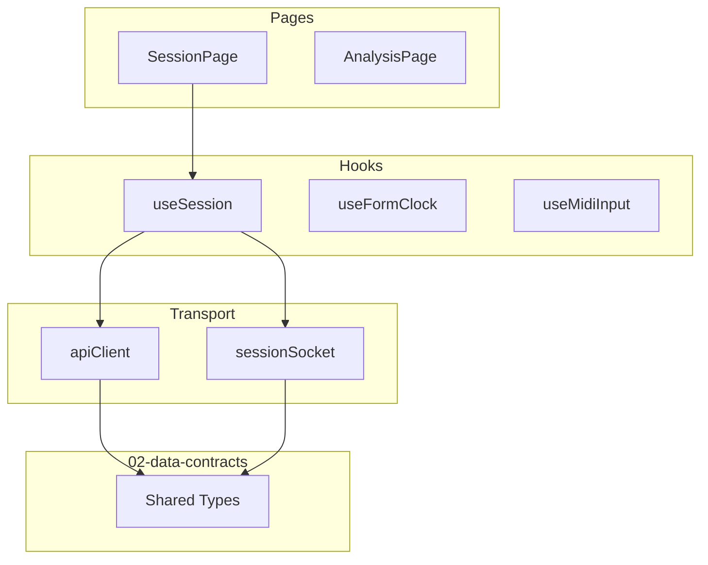

# Frontend Architecture

> Implements [02-data-contracts.md](./02-data-contracts.md) exactly. Overview: [01-app-overview.md](./01-app-overview.md).

## Stack

- Vite + React 19 + TypeScript
- React Router (existing)
- Web MIDI API (browser) for input
- WebSocket client for real-time session events
- `fetch` for REST session management

No solo generation, harmony analysis, or backing-track synthesis on the client. The frontend **renders** and **transports** data per contracts.

## Folder Structure (Target)

```
frontend/src/
  api/
    client.ts           # REST wrapper
    sessionSocket.ts    # typed WebSocket client
  types/
    index.ts            # re-export from shared/ (or mirror contracts until shared pkg exists)
  pages/
    HomePage.tsx        # landing (existing hero)
    SessionPage.tsx     # main jam UI
    AnalysisPage.tsx    # solo analysis view
  components/
    session/
      SessionSetupPanel.tsx
      JamStage.tsx
      FormClockDisplay.tsx
      TurnIndicator.tsx
      BackingControls.tsx
    midi/
      MidiInputHandler.tsx
    audio/
      AudioPlayback.tsx
    analysis/
      SoloAnalysisView.tsx
      NotationView.tsx
      PianoRollView.tsx
    layout/
      Navbar.tsx        # existing
  hooks/
    useSession.ts       # session state + WS subscription
    useFormClock.ts
    useMidiInput.ts
  css/
    nav.css
    hero.css
    session.css
    analysis.css
```

## Routes

| Path | Component | Purpose |
|------|-----------|---------|
| `/` | `HomePage` | Landing, link to start session |
| `/session` | `SessionPage` | Setup + jam stage |
| `/session/:id/analysis` | `AnalysisPage` | View `SoloAnalysis` for a chorus |

Update [App.tsx](../frontend/src/App.tsx) when coding begins.

## Component Map → Contracts

### `SessionSetupPanel`

**Reads/writes:** `SessionConfig`, `ChordChart`

- Chord chart text input (parsed client-side to `ChordChart` for preview; server validates on submit)
- Selectors: `SoloInstrument`, `SoloStyle`, `TurnOrder`, `BackingStyle`
- Multi-select: `BackingInstrument[]`
- Tempo (BPM) input
- Submit → `POST /api/sessions` with `CreateSessionRequest`

### `JamStage`

**Reads:** `SessionResponse`, `FormClock` (from WS `form_clock_tick`)

- Hosts `FormClockDisplay`, `TurnIndicator`, `BackingControls`
- Shows current `SessionPhase` and `activePlayer`
- Start → `POST /api/sessions/:id/start`
- Stop → `POST /api/sessions/:id/stop`

### `FormClockDisplay`

**Reads:** `FormClock`

- Bar / beat display
- Elapsed seconds
- Visual highlight when `isTopOfForm === true`

### `TurnIndicator`

**Reads:** `SessionResponse.activePlayer`, `SessionPhase`

- Shows whose chorus is active
- Optional manual turn request buttons → WS `request_soloist_turn` / `request_player_turn`

### `MidiInputHandler`

**Produces:** `MidiInputMessage`

- Wraps Web MIDI API
- Converts note-on/off + timing to `MidiNoteEvent[]` in beat time (uses `FormClock` for alignment)
- Sends via WS `midi_input`

### `AudioPlayback`

**Reads:** `BackingTrackReadyMessage.audioUrl`, `SoloistMidiOutMessage.notes`

- Plays backing audio from `backing_track_ready`
- Schedules soloist MIDI output (skeleton: simple synth or silent log)

### `SoloAnalysisView`

**Reads:** `SoloAnalysis`, `NotationView`

- Toggle between `NotationView` and `PianoRollView`
- Color-codes notes by `NoteFunction` (chord_tone / color_tone / tension_tone)
- Shows `scaleDegree` labels per note

## Client Layers



### `apiClient`

Typed `fetch` wrapper for all REST endpoints in [02-data-contracts § REST API](./02-data-contracts.md#rest-api).

```typescript
// Shape only — implement when coding
export const apiClient = {
  createSession(req: CreateSessionRequest): Promise<SessionResponse>,
  getSession(id: string): Promise<SessionResponse>,
  updateConfig(id: string, config: SessionConfig): Promise<SessionResponse>,
  startSession(id: string): Promise<SessionResponse>,
  stopSession(id: string): Promise<SessionResponse>,
  getAnalysis(id: string, chorusIndex: number): Promise<SoloAnalysis>,
};
```

### `sessionSocket`

- Connects to `ws://localhost:3001/ws/sessions/:sessionId`
- Parses incoming messages as `ServerMessage` discriminated union
- Dispatches to `useSession` state reducer
- Sends `ClientMessage` types

### `useSession`

Central state hook (session store) holding:

| State field | Source |
|-------------|--------|
| `session` | REST + `session_state` WS |
| `clock` | `form_clock_tick` WS |
| `backingAudioUrl` | `backing_track_ready` WS |
| `soloistNotes` | `soloist_midi_out` WS |
| `latestAnalysis` | `solo_analysis_ready` WS |
| `error` | `error` WS or REST `ApiError` |

## Skeleton Rendering Rules

During skeleton phase, components must:

1. Render real layout shells (not blank pages)
2. Use contract types for all props and state — no ad-hoc shapes
3. Tolerate stub backend data (canned MIDI, placeholder audio URL)
4. Show empty/loading states with correct type structure

## Environment

| Variable | Default | Purpose |
|----------|---------|---------|
| `VITE_API_BASE_URL` | `http://localhost:3001` | REST base |
| `VITE_WS_BASE_URL` | `ws://localhost:3001` | WebSocket base |

## Drift Prevention

- All types and messages are defined in [02-data-contracts.md](./02-data-contracts.md) — this doc references them by name and § section only
- Do not introduce ad-hoc shapes in components or hooks

## Explicit Non-Responsibilities

- Chord-scale analysis logic
- Solo or backing generation
- Form clock timing authority (backend owns the beat)
- FastAPI / ML calls

## Backend Counterpart

See [04-backend-architecture.md](./04-backend-architecture.md) for the Node/TS services that produce every type this frontend consumes.
