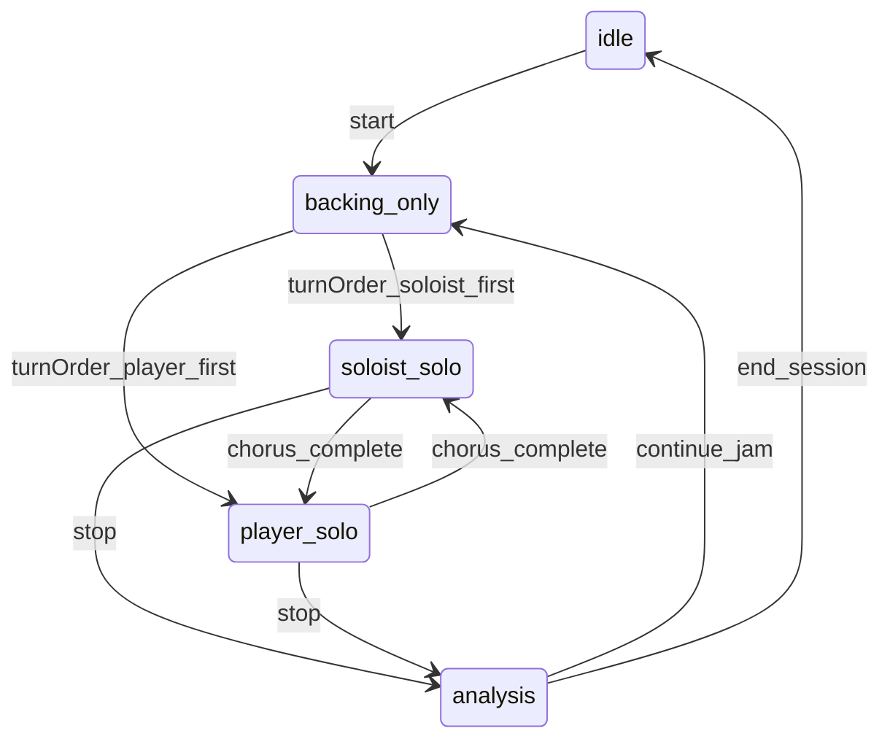
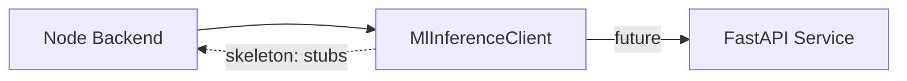

# Backend Architecture

> Implements [02-data-contracts.md](./02-data-contracts.md) exactly. Overview: [01-app-overview.md](./01-app-overview.md).

## Stack

- Node.js + TypeScript
- HTTP server (Express or Fastify — pick at scaffold time)
- `ws` for WebSocket sessions
- No ML in skeleton; stub services return canned data matching contracts
- Future: internal `MlInferenceClient` calls external FastAPI

## Folder Structure (Target)

```
backend/
  src/
    index.ts                  # HTTP + WS server entry
    routes/
      sessions.ts             # REST handlers
    ws/
      sessionHandler.ts       # per-session WebSocket logic
    services/
      SessionService.ts       # phase machine, turn trading
      FormClockService.ts     # beat ticker
      BackingTrackService.ts  # stub audio generation
      SoloistService.ts       # stub solo MIDI out
      AnalysisService.ts      # stub scale-degree labeling
    clients/
      MlInferenceClient.ts    # interface + stub impl
    types/
      index.ts                # re-export from shared/
    stubs/
      chordCharts.ts          # sample tunes
      midiResponses.ts        # canned solo MIDI
      analysisResponses.ts    # canned SoloAnalysis
  package.json
  tsconfig.json
```

## Service Ownership

| Service | Reads | Writes | Contract types |
|---------|-------|--------|----------------|
| `SessionService` | `SessionConfig`, phase events | `SessionResponse` | § Session Types |
| `FormClockService` | `tempoBpm`, `ChordChart` | `FormClock` | § FormClock, `form_clock_tick` |
| `BackingTrackService` | `SessionConfig` | `BackingTrackReadyMessage` | § BackingTrackReadyMessage |
| `SoloistService` | `SessionConfig`, player `MidiNoteEvent[]` | `SoloistMidiOutMessage` | § MidiNoteEvent, `soloist_midi_out` |
| `AnalysisService` | `ChordChart`, `MidiNoteEvent[]` | `SoloAnalysis` | § SoloAnalysis, `solo_analysis_ready` |
| `MlInferenceClient` | `MlSoloRequest`, `MlAnalysisRequest` | `MlSoloResponse`, `MlAnalysisResponse` | § Future ML Boundary |

## Session Phase Machine



### Transition Rules

| From | To | Trigger |
|------|----|---------|
| `idle` | `backing_only` | `POST /start` |
| `backing_only` | `soloist_solo` | `turnOrder === 'soloist_first'` |
| `backing_only` | `player_solo` | `turnOrder === 'player_first'` |
| `soloist_solo` | `player_solo` | `FormClock` reaches end of form |
| `player_solo` | `soloist_solo` | `FormClock` reaches end of form |
| `*` (solo phases) | `analysis` | `POST /stop` |
| `analysis` | `backing_only` | WS `request_*_turn` or auto-continue |
| `analysis` | `idle` | session teardown |

Invalid transitions return `409` with `ApiError` code `INVALID_PHASE_TRANSITION`.

## REST Handlers

Each handler in `routes/sessions.ts` delegates to `SessionService` and returns contract types verbatim.

| Handler | Service calls |
|---------|---------------|
| `POST /api/sessions` | `SessionService.create(config)` |
| `GET /api/sessions/:id` | `SessionService.get(id)` |
| `PATCH /api/sessions/:id/config` | `SessionService.updateConfig(id, config)` |
| `POST /api/sessions/:id/start` | `SessionService.start(id)` → `FormClockService.start()`, `BackingTrackService.generate()` |
| `POST /api/sessions/:id/stop` | `SessionService.stop(id)` → `AnalysisService.analyze()` |
| `GET /api/sessions/:id/analysis/:chorusIndex` | `AnalysisService.get(id, chorusIndex)` |

## WebSocket Handler

`sessionHandler.ts` manages one connection per `sessionId`.

### On connect

1. Validate session exists
2. Send `session_state`
3. Register client for `form_clock_tick` broadcasts

### On `midi_input`

1. Buffer `MidiNoteEvent[]` for current chorus
2. If phase is `player_solo`, pass notes to `SoloistService` as motif input (stub: ignored, returns canned solo at chorus end)

### On chorus boundary (`FormClock` wraps)

1. Increment `currentChorus`
2. If ending `soloist_solo` → switch to `player_solo`, send `session_state`
3. If ending `player_solo` → call `AnalysisService`, send `solo_analysis_ready`, switch to `soloist_solo` or `analysis` per config
4. If new `soloist_solo` → call `SoloistService`, send `soloist_midi_out`

### On `config_update`

- Delegate to `SessionService.updateConfig` (phase-guarded)
- Broadcast `session_state`

## Stub Strategy (Skeleton Phase)

| Service | Stub behavior |
|---------|---------------|
| `BackingTrackService` | Return static `audioUrl` pointing to a bundled silent/placeholder MP3 |
| `SoloistService` | Return `stubs/midiResponses.ts` canned `MidiNoteEvent[]` per `SoloStyle` |
| `AnalysisService` | Return `stubs/analysisResponses.ts` canned `SoloAnalysis` with pre-labeled `AnalyzedNote[]` |
| `MlInferenceClient` | Pass-through to stubs; no HTTP calls |

Stubs **must** conform to [02-data-contracts.md](./02-data-contracts.md) — no extra fields.

## Form Clock

`FormClockService` is the **timing authority**.

- Ticks at `tempoBpm` using `setInterval` or high-resolution timer
- Emits `form_clock_tick` with updated `FormClock` on each beat
- Sets `isTopOfForm: true` when `bar === 1 && beatInBar === 1`
- Resets `totalBeat` to 0 at top of form
- Chorus complete when `bar === chordChart.barCount && beatInBar === beatsPerBar`

## Future ML Integration



Replace stub `MlInferenceClient` implementation with HTTP calls to FastAPI using `MlSoloRequest` / `MlAnalysisRequest` types from contracts. **No contract changes required** on frontend when swapping.

## Error Handling

All errors use `ApiError` from contracts:

| Situation | Code | HTTP/WS |
|-----------|------|---------|
| Bad chord chart | `INVALID_CHORD_CHART` | 400 |
| Bad config values | `INVALID_CONFIG` | 400 |
| Unknown session | `SESSION_NOT_FOUND` | 404 |
| Wrong phase | `INVALID_PHASE_TRANSITION` | 409 |
| WS session mismatch | `WS_SESSION_MISMATCH` | WS `error` |
| Unhandled | `INTERNAL_ERROR` | 500 |

## Environment

| Variable | Default | Purpose |
|----------|---------|---------|
| `PORT` | `3001` | HTTP + WS port |
| `ML_API_URL` | _(empty)_ | FastAPI base URL (future) |

## Drift Prevention

- All types and messages are defined in [02-data-contracts.md](./02-data-contracts.md) — this doc references them by name and § section only
- REST handlers and WS messages must return contract shapes verbatim — no extra fields

## Explicit Non-Responsibilities

- React rendering
- Web MIDI capture (browser-only)
- Audio playback on client device

## Frontend Counterpart

See [03-frontend-architecture.md](./03-frontend-architecture.md) for the React components that consume every type this backend produces.
