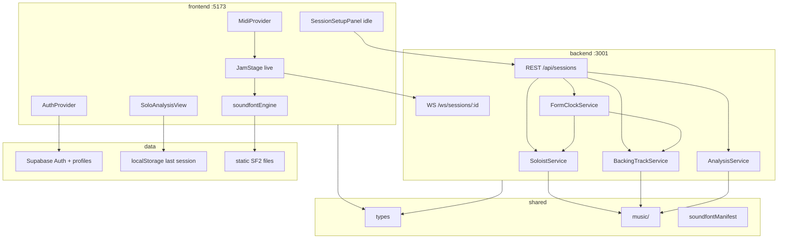

# Current standing — Jazz Gen

Snapshot of what the repo actually does today (as of 2026-07-20). Prefer this document and live code over older README / `cursor-docs` claims where they disagree.

---

## One-sentence summary

A Vite/React + Express jam app with optional Supabase profiles, real Web MIDI + SF2 playback, and a shared TypeScript music library that drives procedural soloist lines, motif trades, theory analysis, backing parts, and server-side form/turn timing — still in-memory and anonymous on the session API, not ML-backed.

---

## Monorepo layout

No root workspace package. Three Node packages + SQL + docs:

```
music_gen_app/
├── frontend/          # Vite, React 19, React Router (:5173)
├── backend/           # Express + ws (:3001)
├── shared/            # @music-gen/shared — types, music engines, SF2 map
├── supabase/          # SQL migrations (profiles + RLS harden)
├── cursor-docs/       # Design notes / contracts / musical catalog
├── README.md
└── current-standing.md
```

| Package | Role |
|---------|------|
| **frontend** | Session / Analysis / Settings / Auth UI; Web MIDI; FluidSynth + oscillators |
| **backend** | REST + WebSocket session orchestration; static `/soundfonts` |
| **shared** | Canonical types, `soundfontManifest`, pure `music/` generators |
| **supabase** | `profiles` table + RLS; applied manually in SQL Editor |

---

## Real vs stub vs planned

### Working end-to-end

| Area | Notes |
|------|--------|
| Session create / start / stop | In-memory `SessionService` |
| WebSocket jam channel | `midi_input` in; state / backing / soloist / analysis out |
| Server form clock + chorus turn flips | `FormClockService` — authoritative; UI soft-syncs |
| Procedural soloist + motif trade | `shared/music` via `SoloistService` |
| Theory analysis | `analyzeNotes` → Analysis UI (not rotating stubs) |
| Backing MIDI by feel | `buildBackingParts` + browser SF2 loop (`audioUrl` empty) |
| Band energy refresh | After player→soloist chorus flip |
| Web MIDI capture | Chrome / Edge → timed notes → WS |
| SF2 playback | Trumpet, piano, guitar, bass/comp/drums kits |
| Last-session analysis | `localStorage` → `/analysis` |
| Supabase email auth + profiles | Frontend-only; does not gate jam |
| Profiles RLS harden | Migrations `001` + `002` |

### Still placeholder / unused

| Area | Notes |
|------|--------|
| Alto / tenor sax | Triangle oscillator (`engine: 'oscillator'`) |
| `MlInferenceClient` | Empty stub file |
| Canned `midiResponses` | File remains; live soloist path does **not** use it |
| Settings “Soloist defaults” / “Account” | “Soon” UI |
| Session / analysis history | One last session only |
| API JWT / user-owned sessions | Not wired |
| WS `config_update` / turn-request messages | Typed, not handled |
| Dedicated `form_clock_tick` messages | Types exist; clock arrives via `session_state` |

### Planned (roadmap leftovers)

- FastAPI ML solo / analysis
- Persist sessions + analysis per user
- JWT-protect session APIs
- Dedicated sax SF2s
- Chart text loaders, audio transcription, richer settings surface
- Doc refresh so README Real-vs-stub matches this file

---

## Architecture (as running)



**Jam flow:** configure (idle) → `POST /api/sessions` → open WS → `POST .../start` → backing (+ soloist MIDI if soloist-first) → FormClock ticks / flips turns → player `midi_input` → Stop → analysis WS + `localStorage` → `/analysis`.

---

## Shared music library (`shared/music/`)

Pure TypeScript (`chart + notes + config → notes/analysis`). Wired from backend services; frontend uses chart presets (and could import analyze helpers later).

| Module | Job |
|--------|-----|
| `pitch.ts` | MIDI ↔ PC, degree labels, key pools |
| `chart.ts` | Parse symbols, expand `ChordChart`, `chordAtBeat` wrap |
| `scales.ts` | Scale menus; chord / color / tension intervals |
| `analyze.ts` | Theory rows over the chart |
| `adapters.ts` | Rows → `AnalyzedNote` / `SoloAnalysis` |
| `phrase.ts` | Split / summarize phrases |
| `solo.ts` | Style-driven autonomous lines |
| `trade.ts` | Motif answers + chorus-vs-phrase heuristic |
| `sessionMemory.ts` | Motif/register memory across turns |
| `backing.ts` | Bass / drums / comp by `backingStyle` |
| `bandArranger.ts` | Chill / steady / push energy |
| `chartPresets.ts` | Blues in F, jazz blues C, rhythm changes Bb |
| `settings.ts` / `quantize.ts` | Internal defaults; grid snap helper |

Tests: `shared/music/music.test.ts` (`npm test` in `shared/`).

Exports: `@music-gen/shared/types`, `…/music`, `…/instruments/soundfontManifest`.

---

## Backend services

| Service | Path | Behavior |
|---------|------|----------|
| SessionService | `backend/src/services/SessionService.ts` | In-memory sessions + player/soloist note buffers |
| FormClockService | `…/FormClockService.ts` | Beat ticks, chorus flips, soloist generate, backing energy refresh |
| SoloistService | `…/SoloistService.ts` | Trade if enough player notes; else `buildSoloNotes` |
| AnalysisService | `…/AnalysisService.ts` | Real `analyzeNotes` + adapter |
| BackingTrackService | `…/BackingTrackService.ts` | `buildBackingParts`; optional `energy` on WS payload |

### REST

- `POST /api/sessions`
- `POST /api/sessions/:id/start` — backing, optional first solo, start clock
- `POST /api/sessions/:id/stop` — stop clock, analyze soloist **or** player notes
- `GET /api/sessions/:id/analysis/:chorusIndex`
- `GET /api/soundfonts/manifest` + static `/soundfonts/*`

### WebSocket

- Connect: `/ws/sessions/:id` → `session_state`
- Client → server: `midi_input` (during `player_solo`)
- Server → client: `session_state`, `backing_track_ready` (+ `energy`), `soloist_midi_out`, `solo_analysis_ready`, `error`

Session APIs are **anonymous** (no JWT). CORS locked to Vite localhost in typical local setup.

---

## Frontend UI

### Routes

| Path | Page |
|------|------|
| `/` | Session (idle setup or full-bleed jam) |
| `/analysis`, `/session/:id/analysis` | Last stopped session analysis |
| `/settings` | MIDI (real); soloist/account placeholders |
| `/login`, `/signup` | Supabase email/password |

### Session idle

- Chart hero: preset, title, BPM, live chord strip
- Three columns: Tune · Soloist (+ Trading: who starts, trade length) · Band (feel + instruments)
- Start CTA

### Session jam

- Setup collapsed; slim strip (title / BPM / “stop to edit”)
- Stage: turn badge, chorus #, trade mode, form progress meter, active-bar chord strip, band strip + energy, MIDI activity, Stop

### Analysis

- Chord strip → **phrase summary** (lead) → tone-count cards → notation / piano roll → **Theory detail** (scale fit + motion)

### Auth

Optional. Profile row from signup trigger; display name in nav. Does not unlock or scope jam data.

---

## Auth / database

| Item | Detail |
|------|--------|
| Table | `public.profiles` (`id` → `auth.users`, display_name, email, timestamps) |
| `001_profiles.sql` | RLS select/update own; trigger-only insert via `handle_new_user` |
| `002_harden_profiles.sql` | Column UPDATE privileges; definer execute lock; `updated_at` trigger |
| Client key | Anon only (`VITE_SUPABASE_*`) — never service_role in frontend |

No Postgres tables for sessions or analysis yet.

---

## Audio / MIDI

| Path | Detail |
|------|--------|
| Input | Web MIDI API → beat-timed `MidiNoteEvent[]` → WS |
| Solo SF2 | Trumpet, piano, guitar via `js-synthesizer` worklet |
| Sax | Oscillator fallback until SF2s land |
| Backing | Loop scheduled MIDI parts on channels from manifest |
| Assets | `backend/src/soundfonts/*.sf2`; Vite proxies `/soundfonts` |

---

## Notable file map

```
shared/types/index.ts
shared/music/*
shared/instruments/soundfontManifest.ts

backend/src/index.ts
backend/src/routes/sessions.ts
backend/src/ws/sessionHandler.ts
backend/src/services/{Session,Soloist,Analysis,BackingTrack,FormClock}Service.ts
backend/src/soundfonts/

frontend/src/pages/SessionPage.tsx
frontend/src/components/session/{SessionSetupPanel,JamStage,FormClockDisplay,TurnIndicator,BackingControls}.tsx
frontend/src/components/analysis/*
frontend/src/hooks/useSession.ts
frontend/src/lib/{soundfontEngine,midiPlayback,sessionDefaults,lastSessionStore,supabaseClient}.ts
frontend/src/context/{AuthProvider,MidiProvider}.tsx

supabase/migrations/001_profiles.sql
supabase/migrations/002_harden_profiles.sql
```

---

## Gaps and doc drift

**Product gaps**

1. No persisted jam history (one `localStorage` slot)
2. No API auth / ownership on sessions
3. No ML soloist or analysis
4. Sax soundfonts missing
5. Mid-session config / manual turn WS messages unused
6. Stop analysis prefers soloist notes if present, else player — not a multi-chorus review UI

**README / cursor-docs drift** (code has moved on)

| Older claim | Actual now |
|-------------|------------|
| Soloist = canned MIDI stubs | Procedural solo + trade engines |
| Analysis = rotating stub labels | Theory engine in `shared/music/analyze.ts` |
| Backend form clock not implemented | `FormClockService` runs and flips turns |
| Session UI = left form / right idle pane | Idle = chart-first full setup; jam = full-bleed stage |

`cursor-docs/musical-features.md` remains a **feature checklist / inspiration** source, not a line-by-line port of Python.

---

## How to run (local)

1. `cd backend && npm install && npm run dev` → `:3001`
2. `cd frontend && npm install && npm run dev` → `:5173`
3. Optional: apply `001` then `002` in Supabase SQL Editor; set `frontend/.env` with project URL + **anon** key

For music unit tests: `cd shared && npm test`.
